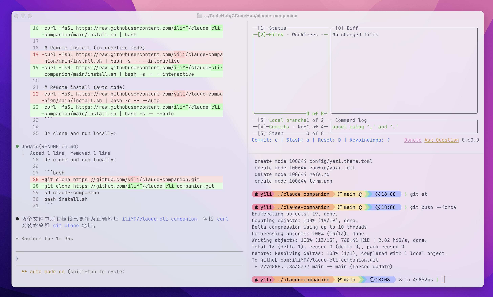

[中文](README.md) | [English](README.en.md)

# Claude Companion

> 一条命令，搭建专为 Claude Code 打造的终端原生开发环境。



---

## 安装

- 远程一键安装
```bash
curl -fsSL https://raw.githubusercontent.com/iliYF/claude-cli-companion/main/install.sh | bash
```

- 远程一键安装（交互模式）
```
curl -fsSL https://raw.githubusercontent.com/iliYF/claude-cli-companion/main/install.sh | bash -s -- --interactive
```

- 远程一键安装（自动模式）
```
curl -fsSL https://raw.githubusercontent.com/iliYF/claude-cli-companion/main/install.sh | bash -s -- --auto
```

或克隆到本地运行：

```bash
git clone https://github.com/iliYF/claude-cli-companion.git
cd claude-companion
bash install.sh
```

### 安装模式

**交互模式** 适合第一次安装，或想自定义工具别名、选择性跳过某些组件的情况。安装过程中会在需要做决定的地方停下来询问你。

**一键模式** 适合想快速搭好环境直接开始用的情况。全程不打扰你，所有选项使用推荐默认值，几分钟内完成安装。

---

## 为什么会有这个项目？

Claude Code 活在终端里，但大多数人给它配的是一个普通终端。文件管理器、Git GUI、编辑器反复切换，每次 Alt+Tab 都在流失上下文。**工具本身很强，但工具之间的空隙让你流血。** Claude Companion 把这些工具整合进一个驾驶舱，消除空隙。

### 全局态势感知

三窗格驾驶舱：Claude Code 在左侧工作，Yazi 在右上实时显示文件变化，Lazygit 在右下追踪每一行代码改动。一个快捷键切换窗格，始终知道 Claude 在做什么。

### 提前发现问题

传统工作流里，你等 Claude 做完，然后才发现跑偏了。在这个驾驶舱里，你在 Yazi 里**实时看到**新文件的出现，在 Lazygit 里**实时看到** diff 的增长。不对劲？立刻打断，修正方向，而不是等到最后才返工。

### 键盘驱动，永不离开终端

Ghostty 的原生分屏、Yazi 的 Vim 式导航、Lazygit 的单键操作 —— 整套工作流全键盘驱动。你的手不需要离开键盘，思维不需要切换窗口，上下文始终在场。

### 经过调优的配置，开箱即用

这套配置不是随便凑的，每一项都为与 Claude Code 协作做了专门考量：

- **Ghostty**：超大滚动缓冲（2500 万行）保住 Claude 的完整输出；命令完成通知让你知道长任务跑完了；毛玻璃效果和 Catppuccin 主题让长时间盯着屏幕不那么痛苦
- **Yazi**：自动刷新文件列表、语法高亮预览、zoxide 快速跳转 —— 浏览 Claude 改动过的代码就像翻书一样
- **Lazygit**：delta 渲染的精美 diff、逐行 stage、一键回退 —— Claude 改错了，三秒撤回

### 一条命令搞定所有配置

不需要手动配置每一个工具，不需要查文档对比参数，不需要踩一遍"字体装了但不显示图标"的坑。

---

## 工具分工

| 工具 | 角色 | 为什么选它 |
|------|------|-----------|
| **Ghostty** | GPU 加速终端，提供分屏框架 | 原生分屏无需 tmux，零延迟渲染，Claude 的大量输出不卡顿 |
| **Yazi** | 文件系统的眼睛 | Rust 编写，极速，实时文件预览，看清 Claude 在文件系统里做了什么 |
| **Lazygit** | 版本控制的记忆 | 可视化 diff，逐行 stage，轻松审查和回退 Claude 的每一处改动 |

---

## 安装内容

| 组件 | 用途 | 是否必装 |
|------|------|----------|
| **Ghostty 配置** | 分屏、主题、快捷键配置 | ✅ |
| **JetBrainsMono Nerd Font** | 支持图标的等宽字体 | ✅ |
| **Starship** | 跨 Shell 提示符，显示 git 状态和 Claude 上下文 | 可选 |
| **Yazi** | 终端文件管理器 —— 实时浏览 Claude 创建的文件 | ✅ |
| **Lazygit** | 终端 Git UI —— 审查并提交 Claude 的修改 | ✅ |
| **git-delta** | Lazygit 中的精美差异视图 | 可选（开发工具） |
| **git-claude-flow** | 专为 Claude Code 工作流优化的 Git 辅助工具 | 可选 |
| **开发工具** | `bat`、`fd`、`ripgrep`、`fzf`、`zoxide` —— Yazi 增强套件 | 可选 |

---

## 一键模式默认值

| 提示项 | 默认值 |
|--------|--------|
| 启用 Starship | 是 |
| 安装可选开发工具 | 跳过 |
| Lazygit Shell 别名 | 取第一个可用别名（`lg` → `lzg` → `lazygit`） |
| 安装 git-claude-flow | 是 |
| gcf 别名 | `claude` |
| gcf 命令 | `claude` |

---

## 安装后快速开始

打开 Ghostty，搭建三窗格工作台：

1. `⌘+D` — 向右分屏 → 运行 `yazi .`
2. `⌘+Shift+D` — 右侧窗格向下分屏 → 运行 `lazygit`
3. `⌘+Alt+Left` — 跳回主窗格 → 运行 `claude`

每个窗格都只需一个快捷键即可切换。零上下文切换，全局态势感知。

---

## 相关项目

- [Ghostty](https://ghostty.org/) — GPU 加速终端模拟器
- [Yazi](https://yazi-rs.github.io/) — 极速终端文件管理器
- [Lazygit](https://github.com/jesseduffield/lazygit) — 终端 Git UI
- [git-claude-flow](https://github.com/yili/git-claude-flow) — 专为 Claude Code 设计的 Git 工作流

---
